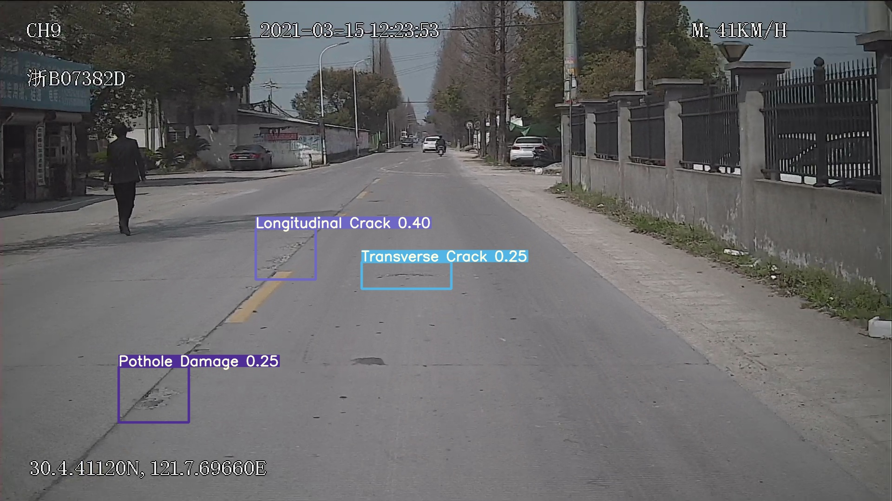

# rddc2020
Project - road damage detection

### Dataset Given

1. Train Split

| **Type** | **Description**    | **Number** |
| -------- | ------------------ | ---------- |
| D00      | Transverse Crack   | 1336       |
| D10      | Longitudinal Crack | 1438       |
| D20      | Alligator Crack    | 735        |
| D40      | Pothole Damage     | 347        |

2. Test Split


| **Type** | **Description**    | **Number** |
| -------- | ------------------ | ---------- |
| D00      | Transverse Crack   | 385        |
| D10      | Longitudinal Crack | 239        |
| D20      | Alligator Crack    | 424        |
| D40      | Pothole Damage     | 139        |

## Installation

**Prerequisites**
This repository is based on source code from rddc2020([https://github.com/USC-InfoLab/rddc2020](https://github.com/USC-InfoLab/rddc2020)) as part of 2020 IEEE Big Data conference and detection framework YOLOv5([https://github.com/ultralytics/yolov5](https://github.com/ultralytics/yolov5)). 

YOLOv5 may be run in any of the following up-to-date verified environments (with all dependencies including [CUDA](https://developer.nvidia.com/cuda)/[CUDNN](https://developer.nvidia.com/cudnn), [Python](https://www.python.org/) and [PyTorch](https://pytorch.org/) preinstalled):

The best model achieved mean F1-score of 0.674878682854973 on test1 and 0.666213894130645 on test2 dataset of the competition.

Sample predictions:

   




## Table of contents
- [Quick start](#quick-start)
- [Dataset Setup for YOLOv5](#Dataset-Setup-for-YOLOv5)
- [Detection / Submission](#Detection)
- [Performance on RDDC test datasets](#Performance-on-RDDC-test-datasets)
- [Training](#Training)


## Quick Start

1. Install anaconda and create virtual environment.

2. Install dependencies in custom conda environment.

```pip install -r requirements.txt```
remenber to install pytorch<=1.8, else the inplace operation will be reported a bug. 

## Dataset Setup for YOLOv5

1. Create txt files for indicing dataset.
Change data path in `convert_annotations.py` and run: 
```Shell
python convert_annotations.py
```

2. Prepare labels in yolo format.
Generate the label files for yolov5 using [scripts/xml2Yolo.py](https://github.com/USC-InfoLab/rddc2020/tree/master/yolov5/scripts/xml2Yolo.py)
```Shell
python3 scripts/xml2yolo.py
```
- Use `python3 scripts/xml2Yolo.py --help` for command line option details


```shell
python scripts/xml2yolo.py --class_file datasets/road2020/damage_classes.txt --input_file data/test.txt
python scripts/xml2yolo.py --class_file datasets/road2020/damage_classes.txt --input_file data/train_aug.txt
```


## Detection / Submission
1. Download weights as mentioned in [IMSC YOLOv5 Model zoo](#IMSC-YOLOv5-Model-zoo)

2. Go to `yolov5` directory
    ```Shell
    cd yolov5
    ```
3. Execute one of the follwoing commands to generate `results.csv`(competition format) and predicated images under `inference/output/`:
    ```Shell
    # inference using best ensemble model for test1 dataset
    python3 detect.py --weights weights/IMSC/last_95_448_32_aug2.pt weights/IMSC/last_95_640_16.pt weights/IMSC/last_120_640_32_aug2.pt --img 640 --source datasets/road2020/test1/test_images/ --conf-thres 0.22 --iou-thres 0.9999 --agnostic-nms --augment
    ```

    ```Shell
    # inference using best ensemble model for test2 dataset
    python3 detect.py --weights weights/IMSC/last_95_448_32_aug2.pt  weights/IMSC/last_95_640_16.pt  weights/IMSC/last_120_640_32_aug2.pt weights/IMSC/last_100_100_640_16.pt --img 640 --source datasets/road2020/test2/test_images/ --conf-thres 0.22 --iou-thres 0.9999 --agnostic-nms --augment
    ```

    ```Shell
    # inference using best non-ensemble model for test1 dataset
    python3 detect.py --weights weights/IMSC/last_95.pt --img 640 --source datasets/road2020/test1/test_images/ --conf-thres 0.20 --iou-thres 0.9999  --agnostic-nms --augment
    ```

    ```Shell
    # inference using best non-ensemble model for test2 dataset
    python3 detect.py --weights weights/IMSC/last_95.pt --img 640 --source datasets/road2020/test2/test_images/ --conf-thres 0.20 --iou-thres 0.9999  --agnostic-nms --augment
    ```

## Training
1. download pre-trained weights from yolov5 repo
    ```Shell
    bash weights/download_weights.sh
    ```
    
2. run following command
    ```Shell
    python3 train.py --data data/road.yaml --cfg models/yolov5x.yaml --weights weight/yolov5x.pt --batch-size 64
    ```
Visit [yolov5](https://github.com/ultralytics/yolov5) official source code for more training and inference time arguments.


